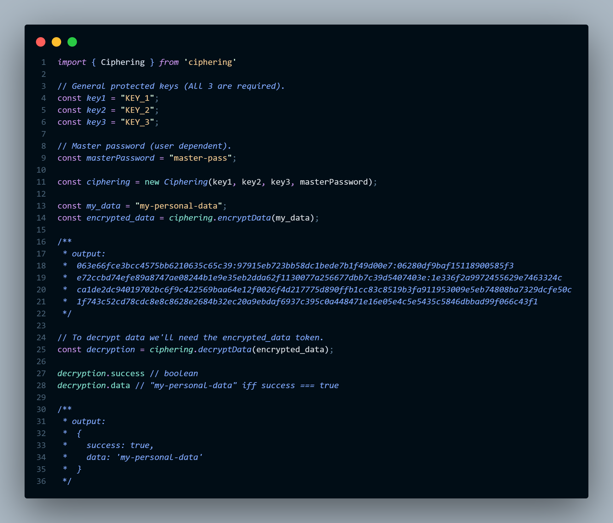

# encrypt data


The typical use case for this high speed Node.js module
is to convert data in common text to
encrypted.

Encryption and decryption of the data is done with the help of military grade encryption (AES-256) [crypto](https://nodejs.org/api/crypto.html).

The data is encrypted with three levels of encryption excluding the one which uses the master key.

Most modern macOS, Windows and Linux systems running Node.js >= 12.13.0
do not require any additional install or runtime dependencies.

## Examples

```sh
npm install ciphering
```

```typescript
const Ciphering = require('ciphering');

// or

import Ciphering from 'ciphering';
```

### Initializing

1. These are general encryption keys,
2. Must be protected and saved in .env file when deployed in production.

```typescript
const key1: string = process.env.KEY_1 as string;
const key2: string = process.env.KEY_2 as string;
const key3: string = process.env.KEY_3 as string;
```

1. Master-Password must be different for every user,
2. But will be same for single user with multiple data.

```typescript
const masterPassword: string = "master-pass";
const ciphering = new Ciphering(key1, key2, key3, masterPassword);
```

### Encrypting Data

```typescript
const my_data: string = "my-personal-data"; // data which to be encrypted
const encrypted_data: string = ciphering.encryptData(my_data); // "ea8dd60fed5..."
```

### Decrypting Data

```typescript
// To decrypt data we'll need the encrypted_data token.
const decryption: string = ciphering.decryptData(encryption); //"my-personal-data"
```

## Image Example


## Contributing

A [guide for contributors](https://github.com/tanishq-singh-2301/ciphering/blob/main/.github/CONTRIBUTING.md)
covers reporting bugs, requesting features and submitting code changes.

[](https://nodejs.org/dist/latest/docs/api/n-api.html#n_api_n_api_version_matrix)

## Licensing

The MIT License (MIT)

Copyright (c) 2022 Tanishq Singh <tanishqsingh640@gmail.com>

Permission is hereby granted, free of charge, to any person obtaining a copy
of this software and associated documentation files (the "Software"), to deal
in the Software without restriction, including without limitation the rights
to use, copy, modify, merge, publish, distribute, sublicense, and/or sell
copies of the Software, and to permit persons to whom the Software is
furnished to do so, subject to the following conditions:

The above copyright notice and this permission notice shall be included in
all copies or substantial portions of the Software.

THE SOFTWARE IS PROVIDED "AS IS", WITHOUT WARRANTY OF ANY KIND, EXPRESS OR
IMPLIED, INCLUDING BUT NOT LIMITED TO THE WARRANTIES OF MERCHANTABILITY,
FITNESS FOR A PARTICULAR PURPOSE AND NONINFRINGEMENT. IN NO EVENT SHALL THE
AUTHORS OR COPYRIGHT HOLDERS BE LIABLE FOR ANY CLAIM, DAMAGES OR OTHER
LIABILITY, WHETHER IN AN ACTION OF CONTRACT, TORT OR OTHERWISE, ARISING FROM,
OUT OF OR IN CONNECTION WITH THE SOFTWARE OR THE USE OR OTHER DEALINGS IN
THE SOFTWARE.